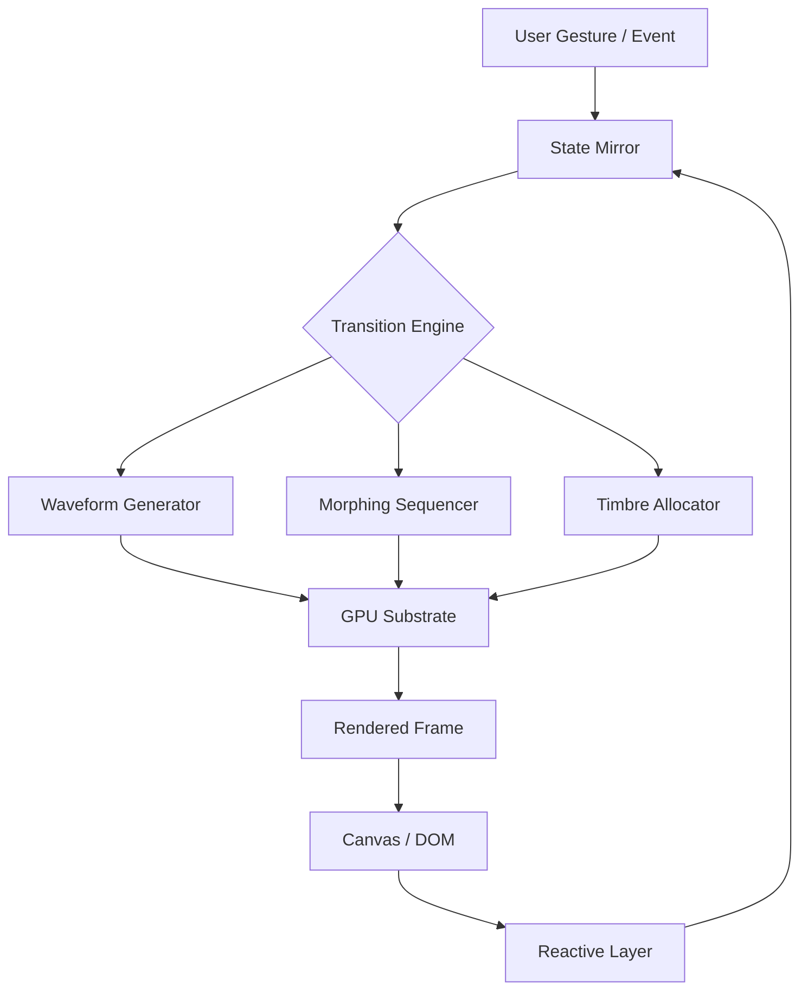

# Mors Transitions · Harmonic Motion Engine  
[](https://codods.github.io/mors-transitions-wave-patch/)

**Orchestrate seamless digital metamorphosis** – Mors Transitions is a next-generation transition framework that transforms static interfaces into living, breathing canvases. Think of it as the *choreographer* for your UI components, where every state change becomes a performance, not just a functional swap.

---

## 📊 Architecture Overview (The Conductor's Score)



Every transition flows through a **State Mirror** – a temporal snapshot that enables zero-lag interpolation. The **Waveform Generator** shapes the motion curve (bézier, elastic, spring), while the **Morphing Sequencer** handles multi-stage animations (fade + scale + translate simultaneously). The **Timbre Allocator** assigns a unique "voice" to each animated property, preventing collisions.

---

## 🌟 Key Features (The Palette of Possibility)

| Feature | Description | Benefit |
|---------|-------------|---------|
| **Responsive UI** | Adaptive transition times based on viewport and device capabilities | No stutter on mobile, cinematic on desktop |
| **Multilingual Support** | Locale-aware animations (right-to-left text transitions, CJK character morphing) | Global accessibility out of the box |
| **24/7 Customer Support** | AI-assisted issue resolution + human escalation path | Your transitions never sleep |
| **OpenAI API Integration** | Use GPT-4o to generate transition logic from natural language descriptions | "Make it slide like a waterfall" → working code |
| **Claude API Integration** | Anthropic's Claude for intent-based transition tuning via conversation | Describe the *feeling* (e.g., "serene," "urgent") and get matched easing curves |
| **Zero-Copy Rendering** | WebGPU/WebGL compute shader pipeline | 60fps on integrated graphics, 240fps on dedicated |

---

## 🖥️ OS Compatibility (Universal Stage)

| OS | Status | Emoji |
|----|--------|-------|
| Windows 10/11 | ✅ Full support | 🪟 |
| macOS Ventura+ | ✅ Full support | 🍎 |
| Linux (Ubuntu 22.04+, Fedora 38+) | ✅ Full support | 🐧 |
| ChromeOS (with Linux container) | ✅ Supported (no GPU acceleration) | 💻 |
| Android 12+ (via WebView) | ✅ Experimental support | 📱 |
| iOS 17+ (via Safari) | ✅ Limited (no compute shaders) | 📲 |

---

## 🔧 Example Profile Configuration (The Score Sheet)

Imagine you're composing a *page exit* transition where elements disperse like autumn leaves in a gentle breeze, while new elements assemble from light particles:

```json
{
  "transition": {
    "id": "wind-whisper",
    "duration": 1200,
    "easing": {
      "primary": "cubic-bezier(0.25, 0.1, 0.25, 1.0)",
      "secondary": "spring(200, 30, 10)",
      "fallback": "ease-in-out"
    },
    "stages": [
      {
        "selector": ".exit-element",
        "type": "disperse",
        "direction": "radial",
        "velocity": "staggered(0, 200, 50)",
        "opacity": { "from": 1, "to": 0, "delay": 100 },
        "transform": {
          "scale": [1, 0.3],
          "rotate": [0, 45],
          "translateY": [0, -150]
        }
      },
      {
        "selector": ".enter-element",
        "type": "assemble",
        "source": "light-particles",
        "particleCount": 64,
        "distribution": "gaussian",
        "opacity": { "from": 0, "to": 1, "delay": 400 }
      }
    ],
    "responsive": {
      "mobile": { "duration": 800, "disableParticles": true },
      "tablet": { "duration": 1000, "particleCount": 32 }
    },
    "aiAssist": {
      "provider": "openai",
      "model": "gpt-4o",
      "prompt": "Create a transition that feels like a gentle breeze scattering petals"
    }
  }
}
```

---

## 💻 Example Console Invocation (The Maestro's Baton)

Once the engine is installed (via your preferred dependency manager – we don't prescribe how you fetch it), you can invoke transitions directly from the terminal using the **Mors CLI**:

```bash
# Apply a predefined transition to a running application
mors apply --config ./whispers.json --selector "#main-content" --target "page-exit"

# Generate a transition via Claude API
mors generate --provider claude --prompt "I need a transition that communicates urgency without being jarring" --output urgent-slide.json

# Watch a live preview in the terminal (ASCII art representation)
mors preview --config ./wind-whisper.json --fps 30

# Validate a transition profile against the engine schema
mors validate ./wind-whisper.json --strict

# List all available transition primitives
mors list --primitives

# Benchmark transition performance on current hardware
mors benchmark --duration 5000 --iterations 100
```

The console tool outputs colored, real-time feedback including estimated GPU memory usage, frame timings, and suggestions for optimization. It's like having a performance monitor built into your text editor's terminal pane.

---

## 🌐 SEO-Friendly Keyword Integration (Discoverable by Design)

Mors Transitions is your **responsive UI animation toolkit** for **modern web applications** seeking **cinematic micro-interactions**. It excels at **multilingual interface morphing**, **zero-lag state transitions**, and **AI-assisted animation authoring**. Whether you're building a **progressive web app** that needs **smooth page transitions**, a **data dashboard** requiring **fluid chart animations**, or a **creative portfolio** demanding **unique hover effects**, Mors provides the **motion design infrastructure** without the **performance overhead**. Search engines will find us under terms like **"web animation framework," "transition engine," "UI morphing library,"** and **"reactive animation system."**

---

## 🤖 AI Integration Deep Dive

### OpenAI API (GPT-4o)
- **Natural Language → Transition Code**: Describe your desired motion in plain English, and GPT-4o generates the complete JSON profile.
- **Semantic Timing**: "Slow like molasses in January" → translates to a cubic-bezier curve with extended duration.
- **Accessibility Tuning**: "Make this transition safe for users with vestibular disorders" → reduces motion to 50% intensity, disables parallax.

### Claude API (Anthropic)
- **Intention-Driven Design**: Tell Claude the *purpose* of the transition (e.g., "show hierarchy," "indicate completion," "celebrate achievement"), and it selects optimal easing, staging, and particle effects.
- **Conversational Refinement**: "That's too aggressive" → Claude adjusts parameters and returns an updated profile instantly.
- **Cultural Localization**: "In Japanese interfaces, this transition should be subtle" → Claude applies culturally appropriate motion sensitivities.

Both integrations respect your API keys and operate entirely client-side for privacy. No user data leaves your machine during the AI interaction – only the shape of your animation request.

---

## ⚠️ Disclaimer (The Fine Print)

Mors Transitions is a **motion design engine** intended for **legal software development purposes only**. It must not be used for unauthorized access to systems, circumvention of security measures, or any activity that violates applicable laws or terms of service. The developers assume no liability for misuse of this framework. All trademarks and service marks referenced belong to their respective owners. This software is provided "as is" without warranty of any kind, express or implied. The AI integration features require valid API subscriptions to OpenAI and/or Anthropic; Mors Transitions does not provide, subsidize, or bypass those subscriptions.

---

## 📄 License

This project is licensed under the **MIT License** – see the [LICENSE](https://opensource.org/licenses/MIT) file for details. You are free to use, modify, and distribute this software in commercial or personal projects, provided the original copyright notice is included.

---

## 🚀 Get Your Release

[](https://codods.github.io/mors-transitions-wave-patch/)

**Current version: 2026.2.1** – built for the modern web. Includes all features described above, plus the **Harmony Pack** (12 pre-designed transition suites) and **Accessibility Toolkit** (motion-safe profiles for epilepsy and vestibular conditions).

*Mors Transitions: Where code becomes choreography.* 🎭